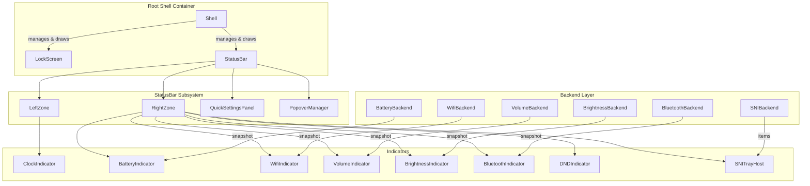

# Status Bar — Design & Architecture

## Overview

A **fully extensible status bar** with two hosts: the chromeless strip on the
lockscreen (`qypr-lock`) and a standalone desktop panel (`qypr-bar`) on
wlr-layer-shell.

**Objective:** `qypr-bar` is not "a waybar clone with a few modules" — the target
is a **full panel replacement of KDE Plasma's calibre**: the panel is the user's
primary interface to the session (windows, workspaces, media, notifications,
power, tray, launchers), it is **configurable without recompiling**, and it works
on any Wayland compositor. Phases 1–8 built the *engine* (plugin registry,
backends, two hosts, Quick Settings, tray). Phases 9+ close the distance to that
objective — see [KDE-Panel Parity — Gap Analysis](#kde-panel-parity--gap-analysis)
for the honest scorecard of what is still missing.

The design draws from three mature desktop shell implementations:

| Desktop | Component | Key Ideas Borrowed |
|---------|-----------|--------------------|
| **KDE Plasma** | Panel + Plasmoids | Corona → Containment → Applet hierarchy; DataEngine / Model-View separation; compact + full representation per widget; `StatusNotifierItem` D-Bus protocol for third-party tray icons |
| **GNOME Shell** | Top Bar + Quick Settings | Three-zone panel (left / center / right); `SystemIndicator` → `QuickToggle` / `QuickMenuToggle` tile pattern; `PanelMenu.Button` for extensible status area |
| **ChromeOS Ash** | Shelf + Unified System Tray | Tray View → Default View → Detailed View hierarchy; `UnifiedSystemTrayModel` state machine; Material You tile grid; modular `ash/system/` controllers |

The status bar is always visible and survives the reveal/dim state machine
(drawn at reduced opacity when idle). It draws **no chrome of its own** — no
background strip, no border: the indicators sit directly on the lockscreen
background (shadowed text, like the lockscreen clock), so bar and lockscreen
are one continuous surface rather than two stacked panels.

```
┌───────────────────────────────────────────────────────────────────────┐
│   Mon Jul 12   3:45 PM                          🔅  🔇  📶  🔋  ⚙    │
│                                                                       │
│         Lockscreen content (clock, password, media, etc.)             │
│                                                                       │
└───────────────────────────────────────────────────────────────────────┘
                                 ↓ click ⚙
┌─────────────────────────────────────────────┐
│  ┌──────────┐  ┌──────────┐  ┌──────────┐  │
│  │ 📶 WiFi  │  │ 🔵 BT    │  │ 🌙 DND   │  │
│  │   On     │  │   Off    │  │   Off    │  │
│  └──────────┘  └──────────┘  └──────────┘  │
│  ━━━━━━━━━━━━━━━━━━━━━━━━━━━━ 🔆 75%       │
│  ━━━━━━━━━━━━━━━●━━━━━━━━━━━ 🔊 60%        │
│  ─────────────────────────────────────────  │
│  ⏱ Battery 87% — 2:30 remaining            │
└─────────────────────────────────────────────┘
```

---

## Design Principles

1. **Strict Decoupling (LockScreen ⟂ StatusBar)** — The lockscreen and the
   status bar are siblings that never reference each other. This is the
   project's structural non-negotiable:
   - `Shell` is the **sole composition point**: it owns both, draws both,
     and routes input between them. Neither child names, includes, or
     shares state with the other.
   - StatusBar code (`ui/statusbar/`, `ui/indicators/`, `system/`) may
     depend only on shared foundations: `EventLoop`, `Painter`, `Theme`,
     `Widget`, and the narrow `Invalidator` interface. It must never see
     lock-specific code (PAM, `LockSession`, `RenderHost::requestUnlock`).
   - Consequence: the bar remains hostable outside the lockscreen (e.g. a
     future layer-shell `qypr-bar`) without surgery, and either subsystem
     can be built, tested, and reasoned about alone.

2. **Minimal Footprint** — qypr's founding objective is minimum memory and
   process count; the status bar must not erode it:
   - **No process may be spawned to read state.** Backends never shell out
     (`wpctl`, `pactl`, etc.) — they use in-process, event-driven APIs. This is
     the rule that actually protects the footprint: a polled `wpctl` is a fork
     per tick, forever.
   - **User-initiated, one-shot launches are allowed** (decision D1): a launcher,
      a `spawn-on-click` command, or `SystemActions`' `systemctl` call is a
     deliberate action with a bounded lifetime, not a monitoring strategy. A
     panel that cannot launch anything is not a panel replacement. Never spawn
     on a timer, and never to answer "what is the current state?".
   - **Push, not poll.** Backends subscribe (D-Bus `PropertiesChanged`,
     protocol events) and put their fds in the epoll `EventLoop`; a
     synchronous fetch is allowed once at startup only.
   - **One bus connection per bus.** All system-bus backends (UPower,
     NetworkManager, BlueZ, logind) share a single `sd_bus` connection
     owned by `SystemBackends`; likewise for the session bus.
   - **Lazy init.** Backends are constructed only when the bar is enabled.

3. **Plugin Architecture** — Every indicator is a self-contained module
   (backend + widget) that registers itself with the bar at startup.
   Adding a new indicator requires zero changes to StatusBar itself.
   *(Inspired by KDE Plasma's Containment/Applet and GNOME's
   `SystemIndicator` pattern.)*

4. **Backend / Frontend Separation** — System state is monitored by backend
   classes (`*Backend`) that produce immutable snapshot structs and notify
   on change. UI indicator classes (`*Indicator`) consume snapshots and
   render. *(Inspired by KDE DataEngines and ChromeOS `ash/system/`
   controllers.)*

5. **Three-Layer View Hierarchy** — Each indicator exposes up to three
   representations, following ChromeOS Ash conventions:
   - **Tray View** — Compact icon in the status bar strip.
   - **Default View** — Summary shown inside the Quick Settings panel.
   - **Detailed View** — Full interactive popover (sliders, lists, etc.)

6. **Quick Settings Panel** — A single expandable panel (like GNOME 43+
   Quick Settings / ChromeOS Unified Tray) that replaces per-indicator
   popovers for toggles. Click the gear icon ⚙ (or any toggle indicator)
   to open the shared Quick Settings panel containing all toggle tiles
   and sliders.

7. **StatusNotifierItem (SNI) Host** — Optional support for the
   freedesktop `StatusNotifierItem` D-Bus protocol, allowing third-party
   applications to register tray icons. *(KDE Plasma's standard protocol,
   de facto Linux tray standard.)*

---

## Architecture

### High-Level Hierarchy

```
Shell (Root UI Compositor — coordinates inputs, layouts, and global idle dimming)
├── LockScreen (Auth UI: Clock, PasswordField, AudioController, Notifications, ConfirmPopover)
└── StatusBar (Status Bar UI: zones, layout, popovers, quick settings)
    ├── LeftZone ─────────────────────────────────────────────
    │   └── ClockIndicator          POSIX time, own formatting (no LockScreen code)
    │
    ├── RightZone ────────────────────────────────────────────
    │   ├── BrightnessIndicator     backlight via sysfs / logind D-Bus
    │   ├── VolumeIndicator         PipeWire / PulseAudio via wpctl or D-Bus
    │   ├── WifiIndicator           D-Bus: org.freedesktop.NetworkManager
    │   ├── BluetoothIndicator      D-Bus: org.bluez
    │   ├── BatteryIndicator        D-Bus: org.freedesktop.UPower
    │   ├── DNDIndicator            local state, notification suppression
    │   ├── SNITrayHost             StatusNotifierWatcher → third-party icons
    │   └── QuickSettingsButton     ⚙ opens the Quick Settings panel
    │
    ├── QuickSettingsPanel ───────────────────────────────────
    │   ├── ToggleTile[WiFi]        on/off + network name
    │   ├── ToggleTile[Bluetooth]   on/off + device count
    │   ├── ToggleTile[DND]         on/off
    │   ├── ToggleTile[NightLight]  on/off (future)
    │   ├── SliderTile[Brightness]  horizontal slider 0-100%
    │   ├── SliderTile[Volume]      horizontal slider 0-100% + mute
    │   └── StatusSummary           battery %, time remaining, profile
    │
    └── PopoverManager ───────────────────────────────────────
        └── DetailedPopover          only one open at a time
```

### Hosts: `qypr-lock` and `qypr-bar`

`StatusBar` depends only on `Invalidator` (repaint) and the `SystemBackends`
aggregate — never on the lock session, video, or PAM. That makes it hostable by
two separate binaries that share the whole object set and differ only in their
entry point and platform surface:

| | `qypr-lock` | `qypr-bar` |
|---|---|---|
| Host class | `App` (implements `RenderHost`) | `BarApp` (implements `Invalidator` + `InputSink`) |
| Platform | `WaylandDisplay` + `Output` on **ext-session-lock-v1** (fullscreen, secure) | `BarDisplay` + `BarWindow` on **wlr-layer-shell** (top-anchored panel, exclusive zone) |
| Composition | `Shell` (LockScreen ⟂ StatusBar peers) | StatusBar only — no LockScreen, video, or PAM |
| Session content | `setSessionContentVisible(false)` — WM widgets **hidden**, backends **not started** | `setSessionContentVisible(true)` — workspaces + active window **shown**, backends started |
| Chrome | chromeless (draws over the dark, dimmed lock video) | **frosted-glass strip** (`setBackdrop`) — translucent surface tint + light sheen + hairline border (the shared `Painter::fillGlass` card, same as the popovers); opacity is the `backdrop` key, and the `qypr-bar` layer namespace lets a compositor add real blur |

`BarDisplay`/`BarWindow` are deliberate parallels of `WaylandDisplay`/`Output`
(the lock path is left untouched); they reuse the shared lower layers —
`ShmBuffer`, `Seat`, `Cursor`, `OutputEnv` and the throttled frame-callback
render loop. `Seat` was decoupled from the concrete `Output` via a
surface→logical-size resolver (`setSurfaceSizer`) so it feeds either host.

**Overlay grow.** The bar's layer surface is only the reserved strip tall
(`kReserved = 66px`) while idle, so the desktop below keeps its clicks. When a
popover or Quick Settings opens, `BarApp` grows every `BarWindow` to
`StatusBar::overlayHeight()` — the strip plus the tallest drawing popover, sized
to fit that popover and **never the whole output** — so the overlay (drawn at
absolute coordinates, exactly as on the lock screen) is visible and grabs input;
it shrinks back on close. Sizing to the popover, not full-screen, is deliberate:
a full-window layer surface is what a compositor animates or blurs *across the
whole screen* when a popover opens (and would put frost over the entire desktop
rather than just the glass). The exclusive zone stays at `kReserved` throughout,
so the overlay floats without reshuffling windows.

### Component Relationships



---

## Plugin / Indicator Registration System

Inspired by KDE Plasma's Corona/Applet model and GNOME's `addToStatusArea()`,
indicators register themselves at startup. The StatusBar never has a hard-coded
list of children.

```cpp
// Registry pattern — indicators self-register
class IndicatorRegistry {
public:
    static IndicatorRegistry& instance();

    // Register a factory. Zone determines left/right placement.
    using Factory = std::function<std::unique_ptr<StatusIndicator>(const SystemBackends&)>;
    void registerIndicator(const std::string& id, Zone zone, int priority, Factory factory);

    // StatusBar calls this once during construction
    std::vector<std::unique_ptr<StatusIndicator>> createAll(const SystemBackends& backends) const;

private:
    struct Entry {
        std::string id;
        Zone zone;
        int priority;       // lower = further left in its zone
        Factory factory;
    };
    std::vector<Entry> entries_;
};

// Macro for zero-boilerplate registration in each indicator's .cpp
#define REGISTER_INDICATOR(id, zone, priority, Type)                           \
    static const bool _reg_##Type = [] {                                       \
        IndicatorRegistry::instance().registerIndicator(                        \
            id, zone, priority,                                                \
            [](const SystemBackends& b) { return std::make_unique<Type>(b); }  \
        );                                                                     \
        return true;                                                           \
    }();
```

**Usage in indicator files:**

```cpp
// src/ui/indicators/BatteryIndicator.cpp
REGISTER_INDICATOR("battery", Zone::Right, 500, BatteryIndicator)
```

---

## Base Classes

### StatusIndicator (Applet / Widget)

Corresponds to KDE's Applet, GNOME's `SystemIndicator`, and ChromeOS's
tray item hierarchy with three representations.

```cpp
class StatusIndicator : public Widget {
public:
    virtual ~StatusIndicator() = default;

    // ─── Tray View (compact, always visible in bar strip) ───
    virtual std::string icon() const = 0;         // nerd font glyph
    virtual std::string label() const { return ""; }  // optional short text
    virtual std::string tooltip() const = 0;      // hover text
    virtual Color iconColor() const { return theme::color::text; }

    // ─── Default View (tile inside Quick Settings panel) ───
    // Return nullptr if this indicator has no Quick Settings tile.
    virtual std::unique_ptr<QSTile> createTile() { return nullptr; }

    // ─── Detailed View (full popover anchored to this indicator) ───
    virtual bool hasDetailedView() const { return false; }
    virtual std::unique_ptr<DetailedPopover> createDetailedView() { return nullptr; }

    // ─── Lifecycle ───
    virtual void poll(int64_t now) {}             // called on timer tick
    virtual void onBackendUpdate() {}             // called when snapshot changes
    virtual void onActivate() {}                  // click / Enter key

    // ─── Input (forwarded by StatusBar) ───
    virtual bool onScroll(double dx, double dy) { return false; }  // scroll-to-adjust

    // ─── State ───
    bool hovered = false;
    bool focused = false;       // keyboard focus
    Animated hoverScale_{1.0};
    Animated hoverAlpha_{0.0};

    // ─── Identification ───
    std::string id() const { return id_; }
    Zone zone() const { return zone_; }
    int priority() const { return priority_; }

protected:
    std::string id_;
    Zone zone_ = Zone::Right;
    int priority_ = 0;
};
```

### QSTile (Quick Settings Tile)

Inspired by GNOME's `QuickToggle` / `QuickMenuToggle` and ChromeOS's
tile grid:

```cpp
class QSTile {
public:
    virtual ~QSTile() = default;

    enum class Type { Toggle, Slider, Info };
    virtual Type type() const = 0;

    // Toggle tiles
    virtual std::string title() const = 0;
    virtual std::string subtitle() const { return ""; }
    virtual std::string icon() const = 0;
    virtual bool isActive() const { return false; }
    virtual void onToggle() {}

    // Slider tiles
    virtual double value() const { return 0.0; }
    virtual void onValueChange(double v) {}
    virtual std::string valueLabel() const { return ""; }

    // Draw
    virtual void draw(Painter& p, Rect bounds, int64_t now) = 0;

    Rect bounds;
    bool hovered = false;
    Animated hoverAnim_{0};
};
```

### DetailedPopover

Glass-morphism card with anchor arrow and dismiss logic:

```cpp
class DetailedPopover {
public:
    virtual ~DetailedPopover() = default;

    virtual void draw(Painter& p, int64_t now) = 0;
    virtual double contentHeight() const = 0;
    virtual double contentWidth() const { return 280.0; }

    // Input
    virtual bool handleClick(double x, double y) { return false; }
    virtual bool handleDrag(double x, double y) { return false; }
    virtual bool handleScroll(double dx, double dy) { return false; }
    virtual bool handleKey(uint32_t keysym) { return false; }

    // Anchor point (set by PopoverManager)
    double anchorX = 0, anchorY = 0;

    // Animation
    Animated openProgress_{0};   // 0=closed, 1=fully open
    bool isOpen() const { return openProgress_.target() > 0.5; }
    void open() { openProgress_.animate(1.0, theme::anim::fast); }
    void close() { openProgress_.animate(0.0, theme::anim::fast); }
};
```

### QuickSettingsPanel

The shared panel that aggregates all toggle/slider tiles. Inspired by
GNOME 43+ Quick Settings and ChromeOS Unified System Tray:

```cpp
class QuickSettingsPanel : public DetailedPopover {
public:
    void addTile(std::unique_ptr<QSTile> tile);

    void draw(Painter& p, int64_t now) override;
    double contentHeight() const override;
    bool handleClick(double x, double y) override;
    bool handleDrag(double x, double y) override;

private:
    std::vector<std::unique_ptr<QSTile>> tiles_;

    // Layout: tiles in a 3-column grid, sliders span full width below
    void layoutTiles();

    // Glass background
    void drawBackground(Painter& p) const;
};
```

---

## Layout Engine

### Three-Zone Panel Layout

Like GNOME's Left / Center / Right panel zones:

```
┌─────────────────────────────────────────────────────────────────────┐
│  LeftZone          │           CenterZone           │    RightZone  │
│  (Clock)           │         (future use)           │  (indicators) │
│  ←── flows right   │         ←── centered ──→       │  flows left →─│
└─────────────────────────────────────────────────────────────────────┘
```

The CenterZone is reserved for future use (e.g., media now-playing title).

### Geometry Constants

```cpp
namespace theme::statusbar {
    // Bar dimensions. Margins align with the lockscreen's content frame
    // (spacing::xlarge sides — same as the notification stack and power
    // column) so bar + lockscreen read as one integrated composition.
    inline constexpr double height         = 36.0;
    inline constexpr double topMargin      = spacing::large;   // 24
    inline constexpr double sideMargin     = spacing::xlarge;  // 48
    inline constexpr double cornerRadius   = 12.0;

    // Indicator spacing
    inline constexpr double iconSize       = 16.0;
    inline constexpr double iconSpacing    = 18.0;    // gap between indicators
    inline constexpr double padding        = 14.0;    // horizontal padding inside bar
    inline constexpr double separatorWidth = 1.0;     // vertical separator between zones

    // Quick Settings panel
    inline constexpr double qsPanelWidth   = 380.0;
    inline constexpr double qsTileSize     = 110.0;   // tile width in grid
    inline constexpr double qsTileHeight   = 64.0;
    inline constexpr double qsTileGap      = 8.0;
    inline constexpr double qsSliderHeight = 40.0;
    inline constexpr double qsPadding      = 16.0;
    inline constexpr double qsCornerRadius = 16.0;

    // Popover
    inline constexpr double popoverWidth   = 280.0;
    inline constexpr double popoverPadding = 16.0;
    inline constexpr double popoverRadius  = 12.0;
    inline constexpr double arrowSize      = 8.0;
}
```

### StatusBar Layout Algorithm

```cpp
void StatusBar::layout(int screenW, int screenH) {
    // 1. Bar strip spans full width with side margins
    double barY = theme::statusbar::topMargin;
    double barX = theme::statusbar::sideMargin;
    double barW = screenW - 2 * theme::statusbar::sideMargin;
    double barH = theme::statusbar::height;
    bounds = {barX, barY, barW, barH};

    // 2. Left zone: clock flows right from left edge
    double cx = barX + theme::statusbar::padding;
    for (auto& ind : leftIndicators_) {
        double w = ind->measureWidth();
        ind->bounds = {cx, barY, w, barH};
        cx += w + theme::statusbar::iconSpacing;
    }

    // 3. Right zone: indicators flow left from right edge
    double rx = barX + barW - theme::statusbar::padding;
    for (auto it = rightIndicators_.rbegin(); it != rightIndicators_.rend(); ++it) {
        double w = (*it)->measureWidth();
        rx -= w;
        (*it)->bounds = {rx, barY, w, barH};
        rx -= theme::statusbar::iconSpacing;
    }

    // 4. Quick Settings panel anchored below right zone
    if (qsPanel_ && qsPanel_->isOpen()) {
        qsPanel_->anchorX = barX + barW - theme::statusbar::qsPanelWidth;
        qsPanel_->anchorY = barY + barH + 4.0;
    }
}
```

---

## Indicator Specifications

### 1. Clock Indicator

| Property | Value |
|----------|-------|
| Zone | Left |
| Priority | 0 |
| Backend | None (POSIX `localtime_r`) |
| Tray view | `"Mon Jul 12   3:45 PM"` text |
| Quick Settings tile | None |
| Detailed popover | None |
| Update interval | Every 1 second via StatusBar's own tick — never LockScreen's clock timer |

- Font: `theme::font::family` at `theme::statusbar::iconSize`
- Formats time itself (`localtime_r` + `strftime`); shares no LockScreen
  widget code (decoupling principle 1)

---

### 2. Battery Indicator

| Property | Value |
|----------|-------|
| Zone | Right |
| Priority | 500 |
| Backend | `BatteryBackend` (UPower D-Bus) |
| Tray view | Battery icon + percentage text |
| Quick Settings tile | `Info` — percentage, time remaining, progress bar |
| Detailed popover | Full battery details + charging animation |

**BatteryBackend** — uses `sd-bus` on the **system** bus (UPower does not
live on the session bus), via the shared `SystemBackends` connection:

- Bus: `org.freedesktop.UPower`
- Path: `/org/freedesktop/UPower/devices/DisplayDevice`
- Properties: `Percentage`, `State`, `TimeToEmpty`, `TimeToFull`, `IsPresent`
- Signal: `org.freedesktop.DBus.Properties.PropertiesChanged` (reactive updates)
- Fallback: enumerate all devices, find `Type=2` (battery)

```cpp
struct BatterySnapshot {
    int percentage = 0;
    enum State { Unknown, Charging, Discharging, Full, PendingCharge } state = Unknown;
    bool present = false;
    int64_t timeToEmpty = 0;    // seconds
    int64_t timeToFull = 0;     // seconds
    double energyRate = 0.0;    // watts (power draw)
    std::string nativePath;     // e.g. "BAT0"
};
```

**Icons** (Nerd Font):

| Level | Discharging | Charging |
|-------|-------------|----------|
| 100% | `󰁹` | `󰂅` |
| 90% | `󰂂` | `󰂋` |
| 80% | `󰂁` | `󰂊` |
| 70% | `󰂀` | `󰢞` |
| 60% | `󰁿` | `󰂉` |
| 50% | `󰁾` | `󰢝` |
| 40% | `󰁽` | `󰂈` |
| 30% | `󰁼` | `󰂇` |
| 20% | `󰁻` | `󰂆` |
| 10% | `󰁺` | `󰢜` |
| 0% | `󰂎` | `󰢟` |

**Color coding:** green (>50%), yellow (20–50%), red (<20%)
**Charging animation:** pulsing glow on icon at 1Hz

**Detailed popover:**

```
┌─────────────────────────────────┐
│  Battery                  87%   │
│  ─────────────────────────────  │
│  ■■■■■■■■■■■■■■■■■■□□  87%     │
│                                 │
│  ⏱  2h 30min remaining         │
│  ⚡ 12.3W power draw            │
│  🔌 State: Discharging          │
└─────────────────────────────────┘
```

---

### 3. WiFi Indicator

| Property | Value |
|----------|-------|
| Zone | Right |
| Priority | 300 |
| Backend | `WifiBackend` (NetworkManager D-Bus) |
| Tray view | WiFi signal icon |
| Quick Settings tile | `Toggle` — on/off + SSID display |
| Detailed popover | Network details, signal strength bar |

**WifiBackend** — uses `sd-bus`:

- Bus: `org.freedesktop.NetworkManager`
- Path: `/org/freedesktop/NetworkManager`
- Enumerate devices → find WiFi (`DeviceType=2`) → read `ActiveAccessPoint`
- AccessPoint properties: `Ssid` (byte array), `Strength` (0-100), `Frequency`, `Flags`
- Properties signal for reactive updates
- Supports `WirelessEnabled` toggle via D-Bus method

```cpp
struct WifiSnapshot {
    bool enabled = false;
    bool connected = false;
    std::string ssid;
    int signalStrength = 0;     // 0-100
    int frequency = 0;          // MHz
    bool secured = false;
    std::string ipAddress;
};
```

**Icons:**

| State | Icon |
|-------|------|
| Strong (≥75%) | `󰤨` |
| Good (50–74%) | `󰤥` |
| Weak (25–49%) | `󰤢` |
| Very weak (<25%) | `󰤯` |
| Disconnected | `󰤭` |
| Disabled | `󰤮` |

**Quick Settings toggle tile:**

```
┌──────────────┐
│  󰤨  WiFi     │
│  MyHomeWiFi  │
└──────────────┘
```

Active state: `theme::color::primary` background
Inactive state: `theme::color::surface` background

---

### 4. Volume Indicator

| Property | Value |
|----------|-------|
| Zone | Right |
| Priority | 200 |
| Backend | `VolumeBackend` (PipeWire/PulseAudio) |
| Tray view | Volume icon |
| Quick Settings tile | `Slider` — horizontal volume slider + mute toggle |
| Detailed popover | Per-sink/source selection (future) |
| Scroll action | Scroll on icon adjusts volume ±5% |

**VolumeBackend** — in-process native client. Shelling out to `wpctl`/
`pactl` is forbidden: forking a process per update violates the
minimal-footprint objective (principle 2).

- libpulse async API against PipeWire's pulse server (`pipewire-pulse`)
- The `pa_context` fds integrate into the epoll `EventLoop` — event-driven,
  zero polling
- Read: sink-info callback at startup; subscribe with
  `PA_SUBSCRIPTION_MASK_SINK` for push updates thereafter
- Write: `pa_context_set_sink_volume_by_index` / `pa_context_set_sink_mute_by_index`

```cpp
struct VolumeSnapshot {
    double level = 0.0;         // 0.0–1.0
    bool muted = false;
    bool available = true;
    std::string sinkName;       // e.g. "Built-in Audio Analog Stereo"
    std::string sinkIcon;       // e.g. "audio-headphones"
};
```

**Icons:**

| Level | Icon |
|-------|------|
| High (≥66%) | `󰕾` |
| Medium (33–65%) | `󰖀` |
| Low (1–32%) | `󰕿` |
| Muted / 0% | `󰝟` |

**Quick Settings slider tile:**

```
┌──────────────────────────────────────────┐
│  󰕾  ━━━━━━━━━━━━━●━━━━━━  75%    󰝟     │
└──────────────────────────────────────────┘
```

- Drag to adjust; click mute icon toggles mute
- Writes volume back immediately via `wpctl set-volume`
- Scroll over tray icon adjusts ±5%

---

### 5. Brightness Indicator

| Property | Value |
|----------|-------|
| Zone | Right |
| Priority | 100 |
| Backend | `BrightnessBackend` (logind D-Bus / sysfs) |
| Tray view | Brightness icon |
| Quick Settings tile | `Slider` — horizontal brightness slider |
| Detailed popover | None |
| Scroll action | Scroll on icon adjusts brightness ±5% |

**BrightnessBackend** — dual-path:

1. **Primary (D-Bus via logind):**
   - Bus: `org.freedesktop.login1`
   - Path: `/org/freedesktop/login1/session/auto`
   - Interface: `org.freedesktop.login1.Session`
   - Method: `SetBrightness("backlight", <device>, <value>)`
   - This approach follows ChromeOS's `powerd` model of using a system
     daemon rather than writing sysfs directly.

2. **Fallback (sysfs direct):**
   - Read: `/sys/class/backlight/*/brightness` and `max_brightness`
   - Write: `/sys/class/backlight/*/brightness`
   - Requires permissions (polkit or suid helper)

```cpp
struct BrightnessSnapshot {
    int current = 0;            // raw hardware value
    int max = 0;                // max hardware value
    double percentage() const { return max > 0 ? 100.0 * current / max : 0; }
    bool available = false;
    std::string device;         // e.g. "intel_backlight"
};
```

**Icons:**

| Level | Icon |
|-------|------|
| High (≥66%) | `󰃠` |
| Medium (33–65%) | `󰃟` |
| Low (<33%) | `󰃞` |

**Quick Settings slider tile:**

```
┌──────────────────────────────────────────┐
│  󰃠  ━━━━━━━━━━━━━━━━●━━━  75%           │
└──────────────────────────────────────────┘
```

---

### 6. Bluetooth Indicator

| Property | Value |
|----------|-------|
| Zone | Right |
| Priority | 350 |
| Backend | `BluetoothBackend` (BlueZ D-Bus) |
| Tray view | Bluetooth icon (blue when active) |
| Quick Settings tile | `Toggle` — on/off + connected device count |
| Detailed popover | Device list with battery levels (future) |

**BluetoothBackend** — uses `sd-bus`:

- Bus: `org.bluez`
- Path: `/org/bluez/hci0`
- Interface: `org.bluez.Adapter1`
- Properties: `Powered`, `Discovering`, `Address`
- Enumerate `/org/bluez/hci0/dev_*` for connected devices
- Device interface: `org.bluez.Device1` → `Connected`, `Name`, `Icon`,
  `Battery` (via `org.bluez.Battery1`)

```cpp
struct BluetoothSnapshot {
    bool available = false;
    bool powered = false;
    bool discovering = false;
    int connectedCount = 0;
    struct Device {
        std::string name;
        std::string address;
        bool connected = false;
        int battery = -1;       // -1 = unknown
        std::string icon;       // "audio-headphones", "input-mouse", etc.
    };
    std::vector<Device> devices;
};
```

**Icons:**

| State | Icon |
|-------|------|
| On, connected | `󰂱` (blue accent) |
| On, idle | `󰂯` |
| Off | `󰂲` |

**Quick Settings toggle tile:**

```
┌──────────────┐
│  󰂱  BT       │
│  2 devices   │
└──────────────┘
```

---

### 7. Do Not Disturb (DND) Indicator

| Property | Value |
|----------|-------|
| Zone | Right |
| Priority | 400 |
| Backend | None — local state, published to Shell |
| Tray view | Moon icon (visible only when DND active) |
| Quick Settings tile | `Toggle` — on/off |
| Detailed popover | None |

The Desktop Notifications spec defines no DND API; every daemon-side DND
control interface is proprietary (SwayNC's `org.erikreider.swaync.cc`,
dunst's `org.dunstproject.cmd0`, ...). qypr depends only on freedesktop
standards — never on a particular daemon — so DND is **qypr-local state**:

- The indicator owns a plain on/off flag and exposes it (`dndActive()`).
- `Shell` — the sole composition point (principle 1) — reads that flag and
  suppresses the notification cards it forwards to the lockscreen while
  DND is on. Neither child references the other; it also must **not**
  reach into the lockscreen's `NotificationMonitor`.
- `NotificationMonitor` keeps observing throughout, so nothing is lost:
  when DND turns off, Shell pushes the accumulated set and the stack
  reappears.
- State lives for the lock session only (a fresh lock starts with DND
  off); no config file, no daemon round-trips.

```cpp
struct DNDSnapshot {
    bool enabled = false;
    int64_t enabledAt = 0;       // timestamp when enabled
    int64_t autoDisableAt = 0;   // 0 = indefinite
};
```

**Icons:**

| State | Icon |
|-------|------|
| DND Active | `󰽥` (accent color) |
| DND Off | (hidden from tray — only shown in QS panel) |

---

### 8. SNI Tray Host (StatusNotifierItem)  — implemented (host mode)

Support for the freedesktop/KDE **StatusNotifierItem** D-Bus protocol, so
third-party applications can display tray icons in the status bar.

*(The `org.kde.*` bus names are the protocol's historical spelling — SNI is
the de facto cross-desktop tray standard implemented by waybar, Plasma, etc.
It is a shared protocol, **not** a specific daemon's private interface, so
hosting it adds no dependency on KDE or any other desktop component — the same
native-only rule that governs the rest of the bar.)*

**Host mode.** SNI has three roles: Watcher, Host, and Item. Exactly one
Watcher may own `org.kde.StatusNotifierWatcher` per session; on a typical
setup another bar (waybar here) already owns it. `SNIBackend` therefore runs
purely as a **Host**: it claims `org.kde.StatusNotifierHost-<pid>-1`, calls
`RegisterStatusNotifierHost` on the existing Watcher, reads the Watcher's
`RegisteredStatusNotifierItems`, and mirrors that list. Claiming the Watcher
name ourselves is deferred to the standalone `qypr-bar` phase (where no other
bar is running); a `NameOwnerChanged` watch re-registers if the Watcher
restarts. This keeps two bars coexisting without fighting over the name.

**Push, one shared session connection.** `SNIBackend` lives on the shared
`SystemBus(BusKind::Session)` connection (the same object the future
session-bus backends use — one connection per bus). It subscribes to the
Watcher's `StatusNotifierItemRegistered`/`Unregistered` and to each item's
`org.kde.StatusNotifierItem` change signals; a per-item change refetches only
the signalling item (matched by sender + path), never the whole list.

```cpp
struct SNIItem {
    std::string service;   // owning bus name (e.g. ":1.48")
    std::string path;      // item object path (e.g. "/org/blueman/sni")
    std::string iconName;  // themed IconName ("" if only a pixmap is shipped)
    std::string title;     // Title (tooltip text)
    std::string status;    // "Active" | "Passive" | "NeedsAttention"
    cairo_surface_t* pixmap = nullptr;  // best IconPixmap → premultiplied cairo
};
```

**Icons.** The item's themed `IconName` is resolved through the shared
`IconResolver`, which now performs a proper freedesktop lookup — the active
icon theme plus its full `Inherits=` chain, searching every context
(`apps`/`status`/`devices`/`panel`/…) via each theme's `Directories=`. This is
what lets a tray status icon like nm-applet's `nm-signal-75` resolve through
theme inheritance (candy-icons → breeze) rather than only app icons. When a
name does not resolve, the app-supplied `IconPixmap` (ARGB, network byte
order) is converted to a premultiplied cairo surface as a fallback.

**Activation.** Left-click issues the item's `Activate(x, y)` (fire-and-forget
async). This works for items that implement it (e.g. blueman). Menu-only
items (nm-applet exposes only `SecondaryActivate`/`Scroll` + a
`com.canonical.dbusmenu`) need context-menu support, which is deferred to
Phase 6 polish along with async item fetch.

`SNITrayHost` renders one small icon per item in the right zone, just left of
the Quick Settings gear (chromeless, like every other indicator — no divider),
and maps a click to the icon under the pointer via the base
`StatusIndicator::onClick` hook.

---

### 9. Workspaces + 10. Active Window (WM widgets)  — session-sensitive

Compositor state widgets, built on standard Wayland protocols only — **no
`hyprctl`, no per-WM IPC**, so they work on Hyprland, Sway, river, and any
other compositor that implements the protocols.

| Widget | Protocol | Shows |
|--------|----------|-------|
| Workspaces (`WorkspacesIndicator`, left zone) | `ext-workspace-v1` (standard) | a pill per workspace, the active one accented, urgent tinted; click switches (`activate` + `commit`). Hidden workspaces are filtered per spec. |
| Active window (`ActiveWindowIndicator`, center) | `wlr-foreign-toplevel-management` (vendored) | the focused window's title (app id fallback), following keyboard focus |
| Pager (`PagerIndicator`, left zone) | both of the above, **correlated** | one chip per workspace holding the app icons believed to live there; click chip = switch workspace, click icon = focus window, middle = close, right = minimize, scroll = cycle. The merged workspaces+taskbar module. |

The active window uses the wlr protocol, not the standard
`ext-foreign-toplevel-list-v1`, because the latter is list-only — it carries no
per-window *focus/activated* state, so it cannot answer "which window is
focused". The wlr protocol is the only broadly supported one that does.

**The pager's window↔workspace inference.** Neither protocol associates
toplevels with workspaces, and per-WM IPC is off the table (above). But a
compositor's own focus behaviour leaks the mapping continuously: switching
workspaces activates some window on the destination, and moving the *focused*
window elsewhere keeps it activated while a different workspace flips to
active. `SessionMapper` (src/system/SessionMapper.{hpp,cpp}) diffs consecutive
snapshot pairs from both backends and maintains a window→workspace map from
four rules: **birth** (new toplevel → active workspace), **bind** (newly
activated toplevel → active workspace, which also carries moved focused
windows), **stickiness** (unobserved windows keep their last home), and
**adoption** (when a workspace vanishes, its residents join whatever becomes
active next — the neighbour that received them). Pure diffable logic, no I/O,
fully unit tested; transient mislabels self-heal on the next activation event.

Both backends (`WorkspaceBackend`, `ToplevelBackend`) bind their own registry
on the host's `wl_display`, so the same classes serve the lock screen and the
standalone `qypr-bar` — each just passes its display. Only `qypr-bar` actually
starts them (see below). Push only: the compositor streams workspace/toplevel
events on the existing display fd; a single startup roundtrip binds + seeds,
then everything is event-driven (no polling, no threads, no extra fd).

**Privacy gate (session-sensitive).** These widgets reveal what you are doing —
your workspace layout and the title of your focused window. Both override
`StatusIndicator::sensitive()` to return `true`, and `StatusBar` hides every
sensitive indicator unless the host opts in via `setSessionContentVisible(true)`
(all layout/draw/hit-testing goes through `StatusBar::isShown`). The lock screen
**never** enables it — and `qypr-lock` does not even start the WM backends — so
nothing about the session leaks on the locked bar. The unlocked `qypr-bar`
turns the gate on (`setSessionContentVisible(true)`) and starts the backends, so
the widgets appear there and only there. This is the one place a bar widget is
deliberately *absent* while locked. Verified live: the locked bar shows neither
widget; the qypr-bar shows workspaces `1 2 3 …` with the active one accented and
the focused window's title.

---

## Keyboard Navigation & Accessibility

Inspired by ChromeOS's full keyboard navigation support for the system tray:

| Key | Action |
|-----|--------|
| `Tab` / `Shift+Tab` | Move focus between indicators |
| `Enter` / `Space` | Activate focused indicator (open popover / toggle) |
| `Escape` | Close open popover / Quick Settings panel |
| `Arrow Left/Right` | Move focus within the bar |
| `Arrow Up/Down` | Adjust slider value in focused tile (±5%) |
| `Home` / `End` | Jump to first / last indicator |

Focus ring: 2px `theme::color::primary` outline with 2px offset, rounded.

**Screen reader support** (future): each indicator exposes:
- Role: `StatusIndicator`
- Name: tooltip text
- State: value + active/inactive

---

## Event Routing & Input Priority

```
1. Power dialog (if active)        — consumes all input
2. Quick Settings panel (if open)  — clicks route to tiles/sliders
                                     Escape dismisses
3. Detailed popover (if open)      — clicks route to popover content
                                     Escape dismisses
4. Status bar indicators           — click activates indicator (own popover or
                                     toggle); the gear is the ONLY Quick Settings
                                     trigger — a display-only indicator (active
                                     window, keyboard layout, system monitor)
                                     does nothing, it must not spawn the panel
                                     scroll adjusts (volume/brightness)
5. Notifications                   — click expand/dismiss
6. Audio panel                     — transport buttons, volume slider
7. Power pill                      — anchor and action buttons
8. Password field                  — keyboard input
```

**Pointer events:**
- `onPointerButton()`: hit-test in order above, first match consumes
- `onPointerMotion()`: update hover state for all hit-testable elements
- `onPointerLeave()`: clear all hover states

**Scroll events on indicators:**
- Volume indicator: ±5% volume per scroll tick
- Brightness indicator: ±5% brightness per scroll tick
- Other indicators: no scroll action

---

## Animations

| Element | Animation | Duration | Easing |
|---------|-----------|----------|--------|
| Indicator hover | Scale 1.0 → 1.12 + brightness boost | 150ms | ease-out |
| Indicator focus ring | Fade in border | 150ms | ease-out |
| Quick Settings open | Fade in + slide down 8px | 200ms | ease-out |
| Quick Settings close | Fade out + slide up 4px | 150ms | ease-in |
| Detailed popover open | Fade in + slide down 6px | 150ms | ease-out |
| Detailed popover close | Fade out | 100ms | ease-in |
| Toggle tile activate | Background color lerp | 200ms | ease-in-out |
| Slider thumb drag | Smooth position follow | 50ms | linear |
| Battery level change | Smooth icon transition (crossfade) | 300ms | ease-in-out |
| Battery charging | Pulsing glow at 1Hz | 1000ms | sine |
| WiFi signal change | Smooth icon crossfade | 300ms | ease-in-out |
| DND toggle | Icon scale bounce | 200ms | spring |
| SNI icon appear | Fade in + slide right | 200ms | ease-out |
| Bar idle dim | Opacity 1.0 → 0.4 | 500ms | ease-in-out |

---

## KDE-Panel Parity — Gap Analysis

Scored against the stated objective: a **full panel replacement of KDE Plasma's
calibre**. Phases 1–8 delivered the engine and the system-status widgets; what
remains is mostly *session* surface area (windows, media, notifications, power),
**configurability**, and depth inside the widgets that already exist.

### Feature matrix

| KDE Plasma panel feature | qypr today | Gap | Phase |
|---|---|---|---|
| Panel surface, exclusive zone, multi-monitor | ✅ `BarWindow` per output, reserves its zone | — | 7 ✅ |
| Plasmoid/applet architecture | ✅ `IndicatorRegistry` + 3-layer views | compile-time only (see below) | 1 ✅ / 9 |
| Pager (virtual desktops) | ✅ `WorkspacesIndicator` | — | 8 ✅ |
| System tray (SNI) | ✅ icons + left `Activate` + **right-click dbusmenu** (submenus, toggles, drill-down) + middle `SecondaryActivate` + **`Scroll(dx,dy)` forwarded to the under-cursor item** + **overflow chevron → "Hidden items"popover (Passive items per spec)** | — | 6 / 13 ✅ |
| Battery / power management | ✅ UPower + QS tile + **power-profile switching** (`net.hadess.PowerProfiles`) | charge thresholds | 14 ✅ |
| Brightness | ✅ sysfs + logind + slider | multi-display, keyboard backlight | 14 |
| Networks | ✅ WiFi status + toggle + **AP picker** (join saved / disconnect, signal + secured + saved) | new-secured-AP join (secret agent), ethernet, VPN | 14 ✅ |
| Bluetooth | ✅ status + toggle + **device picker** (connect/disconnect, per-device battery) | — | 14 ✅ |
| Audio volume | ✅ master sink + QS mute + **output-device switching** + **per-app stream volumes** | input/source device switching | 4 / 14 ✅ |
| Clock | ✅ time text + **calendar popover** (month nav, week numbers, secondary timezones), format config | — | 12 ✅ |
| **Task manager (window list)** | ✅ icons-only taskbar: all toplevels, click-to-focus, click-focused-to-minimize, **middle-click close**, minimized dimming | grouping, pinning | 11 ✅ |
| **Notifications applet + history** | ✅ bell + count + history popover; per-row **dismiss**, **Clear all**, **scroll**, relative timestamps, critical accent | per-app inline actions (buttons) | 10a ✅ |
| **Media player (MPRIS)** | ✅ now-playing + transport popover, pushed (no poll) | album art, seek, explicit player switching | 10b ✅ |
| **Session / power menu** | ✅ Lock/Suspend/Hibernate/Restart/Shut Down, arm-then-confirm | logout (session-manager specific) | 10a ✅ |
| **Application launcher** | ✅ bar button spawning `waylaunch` (D1 one-shot), bar-only — in-bar search popover **removed** as duplicate UI | favourites, icons, recent/frequent (waylaunch's domain) | 15 ✅ |
| Clipboard history (Klipper) | ❌ none | applet + history popover | 15 |
| Keyboard layout indicator | ✅ active xkb layout code (push from `Seat`); hides with a single layout, bar-only | switch (not possible as a pure Wayland client — compositor keybind) | 15 ✅ |
| Idle inhibitor | ❌ none | toggle (idle-inhibit protocol / logind) | 15 |
| System monitors (CPU/RAM/net/disk/temp) | ❌ none | compact meters + tooltips | 15 |
| **User configuration** | ✅ `bar.conf` (INI): modules per zone, geometry, backdrop, clock formats | per-module `spawn-on-click` (D1) lands with the launcher | 9 ✅ |
| Panel geometry (edge, size, auto-hide, floating) | ⚠️ position top/bottom, height, margins — config-driven | **auto-hide/dodge**, left/right edges, per-output selection | 9 (deferred) |
| Widget add/remove/reorder at runtime | ✅ config-driven; any module in any zone | no runtime editor planned (restart to apply) | 9 ✅ |

### The three structural gaps

1. ~~**No configuration system at all.**~~ **CLOSED by Phase 9.** Every choice —
   which modules appear, their order, the bar height/edge, the clock format, the
   backdrop — was a compile-time constant, making adoption impossible without a
   recompile. Now `bar.conf` (INI, hand-rolled, no new dependency) drives all of
   it. As predicted, `IndicatorRegistry` already keyed factories by `id` + `zone`
   + `priority`, so selection became a filter in `createAll()` and the indicators
   were untouched; config reaches them via a `const Config*` on the existing
   `SystemBackends` aggregate, so `qypr-lock` just passes `nullptr`.
   *(Phase 9 also absorbed `NotificationMonitor`'s **hardcoded
   `/home/arch/.config/qypr/sensitive_apps.conf`** — a portability bug that
   silently fell back to defaults for every other user; it is now XDG-resolved.)*
   **Still open:** auto-hide/dodge, left/right edges, per-output selection.

2. ~~**The session surface is missing.**~~ **CLOSED by Phases 10–11.** A KDE
   panel is how you *drive the session*; qypr's bar only *reported system state*.
   The three biggest absences — window list, notification history, media controls
   — are what make a panel a panel. As predicted, **most of this was already built
   and merely lock-only**: `MprisController`, `NotificationMonitor` (+
    `NotificationLog` backlog), and `SystemActions` were complete classes `BarApp`
   simply did not instantiate (surfaced in Phase 10); and `ToplevelBackend`
   **already tracked every toplevel**, so the taskbar (Phase 11) only had to expose
   the full list + add `activate`/`minimize`. All are session-sensitive, so none
   leak onto the lock screen.

3. **Widget depth stops at "status".** WiFi/Bluetooth/Volume show state and
   toggle, but cannot *do the thing* users open them for: pick a network, connect
   a headset, move audio to another device, or mute one app. Each has its backend
   and its `DetailedPopover` slot already; the gap is list UI + a few more D-Bus
   calls (Phase 14).

### Outstanding architectural decisions

These need a ruling **before** the phases that depend on them; each is a genuine
tension with an existing principle, not an oversight.

| # | Decision | Why it's contested | Recommendation |
|---|---|---|---|
| D1 | **May the bar spawn processes?** | Principle 2 says "no new processes" — but a launcher, "open pavucontrol", or clipboard→rofi inherently spawn, and a panel without them is not a replacement. Note `PowerManager` (since renamed `SystemActions`) **already `fork`+`execlp`s `systemctl`**, so the codebase's real rule is narrower than the prose. | **Sharpen the principle, don't break it:** forbid spawning *to read state* (the actual footprint enemy: no `wpctl` polling); allow **user-initiated, one-shot** launches (`spawn-on-click`, launcher). Document the distinction in Principle 2. |
| D2 | **Config format** | No precedent in-repo (`sensitive_apps.conf` is ad-hoc lines). Adding a TOML/JSON lib fights the minimal-dependency ethos. | A **small hand-rolled INI/key-value parser** (~150 LOC, no new dependency), matching the existing `.conf` convention. Sections per module, `modules-left/center/right` ordering keys. |
| D3 | **Runtime config reload** | Nice-to-have; `inotify` on the config file fits the epoll loop cleanly (push, not poll). | Ship Phase 9 **without** reload; add inotify later if wanted. Restarting a 1MB bar is cheap. |
| D4 | **MPRIS polls 1×/sec** | `MprisController` refreshes on a timer — a standing violation of Principle 2 ("push, not poll") that is tolerable on the lock screen but not for an always-running panel. | Convert to `PropertiesChanged` push **as part of Phase 10**, before it is surfaced in the bar. |
| D5 | **Taskbar vs. protocol limits** | `wlr-foreign-toplevel-management` gives title/app-id/state and `activate`/`close`/`minimize` — enough for a taskbar. But app **icons** need `.desktop` lookup by app-id (fuzzy, imperfect). | Accept fuzzy icon resolution (reuse `IconResolver` + a `.desktop` index, shared with the Phase 15 launcher); fall back to the app-id initial glyph. |
| D6 | **Scope of "no daemon-specific interfaces"** | The user's waybar runs `swaync-client` (notification centre) and KDE Connect — both daemon-specific. | Hold the line: qypr's notification applet uses its **own** `NotificationMonitor` (works with any daemon). KDE Connect stays **out of scope** (it is an app integration, not a standard). |

---

## Phases

### Phase 1 — Core Framework & Plugin System

Create the container, base classes, registration system, and Quick Settings
panel skeleton. Pure UI, no system backends yet.

| File | Purpose |
|------|---------|
| `src/ui/statusbar/StatusBar.hpp` | Container: zones, layout, event routing |
| `src/ui/statusbar/StatusBar.cpp` | Implementation |
| `src/ui/statusbar/StatusIndicator.hpp` | Base class for all indicators |
| `src/ui/statusbar/StatusIndicator.cpp` | Base draw/hover/focus logic |
| `src/ui/statusbar/QSTile.hpp` | Quick Settings tile base class |
| `src/ui/statusbar/QSTile.cpp` | Tile draw logic (toggle + slider) |
| `src/ui/statusbar/QuickSettingsPanel.hpp` | Aggregated tile panel |
| `src/ui/statusbar/QuickSettingsPanel.cpp` | Grid layout, tile management |
| `src/ui/statusbar/DetailedPopover.hpp` | Generic popover base |
| `src/ui/statusbar/DetailedPopover.cpp` | Popover draw, anchor, dismiss |
| `src/ui/statusbar/PopoverManager.hpp` | Manages one-at-a-time popover lifecycle |
| `src/ui/statusbar/PopoverManager.cpp` | Implementation |
| `src/ui/statusbar/IndicatorRegistry.hpp` | Plugin registration system |
| `src/ui/statusbar/IndicatorRegistry.cpp` | Factory storage + creation |

**Deliverables:**
- Status bar indicators render chromeless, directly on the lockscreen
  background (no strip, no border — one integrated surface)
- Keyboard focus traversal works (Tab/Shift+Tab/Escape)
- Quick Settings panel opens/closes with animations
- Empty indicator slots accept registered indicators
- Popover manager handles open/close lifecycle

---

### Phase 2 — Clock + Battery (Simplest Indicators)

| File | Purpose |
|------|---------|
| `src/ui/indicators/ClockIndicator.hpp` | Clock text indicator |
| `src/ui/indicators/ClockIndicator.cpp` | Time formatting, self-registers to Left zone |
| `src/ui/indicators/BatteryIndicator.hpp` | Battery icon + popover |
| `src/ui/indicators/BatteryIndicator.cpp` | Renders battery, creates QS Info tile |
| `src/system/BatteryBackend.hpp` | UPower D-Bus monitor |
| `src/system/BatteryBackend.cpp` | PropertiesChanged signal, snapshot production |

---

### Phase 3 — Volume + Brightness (Interactive Sliders)

| File | Purpose |
|------|---------|
| `src/ui/indicators/VolumeIndicator.hpp` | Volume icon + scroll-to-adjust |
| `src/ui/indicators/VolumeIndicator.cpp` | Renders icon, creates QS Slider tile |
| `src/system/VolumeBackend.hpp` | PipeWire/PA via wpctl |
| `src/system/VolumeBackend.cpp` | Poll + write volume |
| `src/ui/indicators/BrightnessIndicator.hpp` | Brightness icon + scroll-to-adjust |
| `src/ui/indicators/BrightnessIndicator.cpp` | Renders icon, creates QS Slider tile |
| `src/system/BrightnessBackend.hpp` | logind D-Bus / sysfs backlight |
| `src/system/BrightnessBackend.cpp` | Read/write brightness |

---

### Phase 4 — WiFi + Bluetooth + DND (Toggle Tiles)

| File | Purpose |
|------|---------|
| `src/ui/indicators/WifiIndicator.hpp` | WiFi signal icon |
| `src/ui/indicators/WifiIndicator.cpp` | Signal-strength icon, QS Toggle tile |
| `src/system/WifiBackend.hpp` | NetworkManager D-Bus |
| `src/system/WifiBackend.cpp` | SSID, signal, connected state |
| `src/ui/indicators/BluetoothIndicator.hpp` | BT icon |
| `src/ui/indicators/BluetoothIndicator.cpp` | Connected count, QS Toggle tile |
| `src/system/BluetoothBackend.hpp` | BlueZ D-Bus |
| `src/system/BluetoothBackend.cpp` | Adapter/device enumeration |
| `src/ui/indicators/DNDIndicator.hpp` | Moon icon (visible when active) |
| `src/ui/indicators/DNDIndicator.cpp` | Local state toggle, QS Toggle tile |

---

### Phase 5 — SNI Tray Host (Third-Party Icons)  ✅

| File | Purpose |
|------|---------|
| `src/system/SNIBackend.hpp/.cpp` | Host-mode StatusNotifierItem client on the shared session bus: register host, mirror the Watcher's items, per-item `GetAll` + `IconPixmap` → cairo, `Activate(ii)` |
| `src/system/SystemBus.*` | `BusKind::Session` opens the user session bus with the same push/one-connection semantics as the system bus |
| `src/ui/indicators/SNITrayHost.hpp/.cpp` | Renders one themed icon per item in the right zone; per-icon click → `activate()` via the `StatusIndicator::onClick` hook |
| `src/ui/IconResolver.*` | Inheritance-aware freedesktop lookup (active theme + `Inherits=` chain, all contexts) so tray status/device icons resolve |

Verified live against waybar's Watcher with nm-applet + blueman: both icons
render (nm-applet `nm-signal-75` resolves via candy-icons → breeze), and
blueman's real `Activate(ii)` is the click target. Context menus
(`com.canonical.dbusmenu`, required by menu-only items like nm-applet) and
async item fetch are Phase 6.

---

### Phase 6 — Integration & Polish

| File | Changes |
|------|---------|
| `src/ui/Shell.hpp` | Root UI compositor class header |
| `src/ui/Shell.cpp` | Implement layout, draw, input routing, idle/dim timer |
| `src/ui/LockScreen.hpp` | Remove `InputSink` inheritance, remove idle, add `handle*` input methods |
| `src/ui/LockScreen.cpp` | Remove idle/dim logic, delegate drawing of video to Shell |
| `src/ui/Theme.hpp` | Add `theme::statusbar::` namespace constants |
| `src/core/App.hpp` | Swap `LockScreen` member for `Shell` member |
| `src/core/App.cpp` | Wires Wayland input and render functions to `Shell` |

**Shell integration:**

- **Decoupling contract (principle 1):** `LockScreen` and `StatusBar` never
  reference each other; all coordination flows through `Shell`. Each child's
  `handle*` method returns whether it consumed the event, so Shell routes by
  priority without either child knowing what else exists. StatusBar is handed
  an `Invalidator`, never a `RenderHost` — the compiler enforces that it
  cannot unlock the session.
- Owns `LockScreen` and `StatusBar` as peer members.
- In `draw()`: draws the video/gradient background, darken overlay, calls `lockScreen_.draw()`, calls `statusBar_.draw()`, and then draws the global idle dim overlay.
- In `onPointerButton()`: routes pointer events to `StatusBar` popovers first, then `StatusBar` indicators, then notifications/power buttons in `LockScreen`.
- In `onPointerMotion()`: updates hover states for both status bar indicators and lockscreen widgets.
- In `onSpecialKey()`: Tab cycles keyboard focus through indicators; Escape closes popovers. All other keyboard inputs are routed to `LockScreen` password field.
- Manages `dimAnim_` and `idleTimer_`. Any pointer/keyboard activity wakes the shell from idle (resuming video and fading out the dim veil) and resets the timer.
- Both `LockScreen` and `StatusBar` survive the idle dim state machine and render at reduced opacity when idle.

**Preview mode:**

- Updates `App::preview()` to run against `Shell` and trigger status bar previews.
- Render status bar at fixed time (3:45 PM) for reproducible screenshots.
- Render Quick Settings in both open and closed states for previews.

---

### Phase 9 — Configuration & Panel Geometry  ✅

Closed the gap that made "full replacement" impossible: **nothing was
configurable without a recompile**. A small hand-rolled INI parser (D2 — no new
dependency), read once at startup (D3 — no reload). Example: `examples/bar.conf`.

| File | Purpose |
|------|---------|
| `src/core/Config.hpp/.cpp` | INI parser + typed accessors (`getString/Int/Double/Bool/List`); resolves `$XDG_CONFIG_HOME/qypr/bar.conf`. Also fixed `NotificationMonitor`'s hardcoded `/home/arch/…` path |
| `src/ui/statusbar/IndicatorRegistry.*` | `ModuleSelection` + `createAll(backends, sel)`: select by id, order per zone, re-home across zones; unknown ids reported and skipped. `nullptr` = compiled defaults |
| `src/ui/statusbar/StatusIndicator.hpp` | `SystemBackends.config` — how indicators reach config with no new plumbing; `setZone()` for re-homing |
| `src/ui/statusbar/StatusBar.*` | `BarGeometry` + `setGeometry()`; bounds measured from `screenH` so `bottom` pins correctly in both host states; `setBackdrop(on, alpha)` |
| `src/ui/statusbar/DetailedPopover.hpp` | `growUp` — a bottom bar opens panels upward instead of off-screen |
| `src/wayland/BarWindow.*`, `BarDisplay.*` | Anchor top **or bottom**; height/zone from config |
| `src/core/BarApp.*` | Owns `Config` (declared first — init order); feeds geometry, module set, backdrop |

**Config surface (shipped):** `[bar]` `position` (top/bottom), `height`,
`margin`, `margin-side`, `backdrop` (0–1), `modules-left/center/right` (ordered;
any module in any zone; empty value = empty zone); `[clock]` `format`,
`tooltip-format`.

**Deferred (not built):** `auto-hide`/dodge (needs a pointer-proximity + reveal
state machine — its own work), left/right edges, `outputs = …` selection, and
per-module `spawn-on-click` (D1 — lands with the Phase 15 launcher, its first
consumer).

**Verified live:** `position=bottom` → layer at y=1138 h=62 (margin 12 + height
44 + gap 6); `format = CFG %H:%M:%S` → `CFG 12:47:41`; clock ordered ahead of
workspaces; wifi/bt/brightness/dnd dropped; centre emptied; a typo names the bad
id and lists the valid ones; **no config reproduces the shipped bar exactly**
(top, h=66, silent).

> **Test-harness note.** The `TEST` macro runs bodies during *static
> initialisation*, so the compiled-in `REGISTER_INDICATOR` set may not exist yet
> (cross-TU static init order is unspecified) — a test leaning on
> `IndicatorRegistry::instance()` passes or fails by link order. The Phase 9
> registry tests therefore build a **local** `IndicatorRegistry`, which is both
> hermetic and keeps fake indicators out of the global one.

---

### Phase 10 — Session Surface: Media, Notifications, Power  *(mostly surfacing existing code)*

The three biggest "it's not a panel" absences — and all three classes **already
exist**, merely never instantiated by `BarApp`.

**10a — Notifications + Power ✅**

| File | Purpose |
|------|---------|
| `src/ui/indicators/NotificationIndicator.hpp/.cpp` | Bell + count; **history popover** (newest-first, app/title/body, critical accented) over the existing `NotificationMonitor`. DND mutes the glyph but keeps the count |
| `src/ui/indicators/PowerMenuIndicator.hpp/.cpp` | Session menu over the existing `SystemActions`: Lock / Suspend / Hibernate / Restart / Shut Down |
| `src/power/SystemActions.*` | Added `lock()` via `loginctl lock-session` (the standard path — qypr never launches itself); `run()` generalised to `runCmd(prog, arg)` |
| `src/ui/statusbar/StatusIndicator.hpp` | `SystemBackends.power` / `.notifications` — supplied only by `BarApp` |
| `src/core/BarApp.*` | Owns `NotificationMonitor` (push, no backlog seed — that is the lock screen's concern) + `SystemActions` |

**Safety.** Destructive rows (everything but Lock) **arm on the first click and
fire only on a second**, so a stray click on a panel button cannot power the
machine off. A click elsewhere disarms. *(Verified by inspection + visually; not
unit-tested — `SystemActions` is a no-op under `TESTING`, so a fired action is
unobservable, and the popover lives in an anonymous namespace.)*

**Double-gated privacy.** Both applets are session-sensitive **and** hide
themselves when their backend is null. `qypr-lock` supplies neither, so they do
not exist there at all — it keeps its own ConfirmPopover and notification stack
behind the reveal. Verified: `--preview` shows no bell and no power button.

**Verified live:** `notify-send` → bell counts 1, 2, 3 in real time; the history
popover lists all three newest-first with app/title/body, the `-u critical` one
accented red; the power menu renders all five rows. Notification content comes
from qypr's **own** daemon-agnostic monitor — no `swaync-client` (D6).

**10a′ — Interaction pass (enhance QS + notifications) ✅**

| File | Purpose |
|------|---------|
| `src/notifications/NotificationActions.hpp/.cpp` | **Send-side companion** to `NotificationMonitor`. The monitor connection is a `BecomeMonitor` — the D-Bus spec forbids it from *ever* sending — so dismissal cannot ride it. This is a normal caller on the shared **session** bus that fires `org.freedesktop.Notifications.CloseNotification` (fire-and-forget async); the daemon answers with `NotificationClosed`, which the monitor already observes, so the card leaves through the normal push path. Daemon-agnostic (D6) |
| `src/ui/indicators/NotificationIndicator.cpp` | Popover gains a per-row **dismiss (×)** (fades in on row hover; only once the daemon has assigned an id), a **Clear all** header button (copies ids first — each close mutates the monitor's vector), **scrolling** (`kMaxRows = 6` with a "showing x–y of n" hint), **relative timestamps** (`now`/`5m`/`2h`), and a red accent for critical urgency |
| `src/ui/statusbar/QSTile.*` | `QSSliderTile` icon becomes a **live mute button**: an optional trio (`dynamicIcon` per-frame glyph, `onIconClick`, `dimmed`) turns the speaker into a toggle that greys the row and flattens the fill while muted, without disturbing plain sliders (brightness). The icon's hit box is recorded in `draw()`; a press there toggles mute instead of scrubbing |
| `src/ui/indicators/VolumeIndicator.cpp` | Passes that trio: glyph follows sink mute/level, click calls the existing `VolumeBackend::toggleMute()`, row greys while muted |

**Verified** with offscreen render harnesses on the real objects: the slider tile
draws both unmuted (blue fill, speaker) and muted (greyed, muted-speaker) states,
and an icon-click toggles mute while a mid-track click scrubs; the popover renders
the header/Clear-all/critical-red/timestamps, the × fades in on hover, and the
dismiss/clear-all hit-tests fire `CloseNotification`. `--preview` confirms the
locked bar still carries **no** bell/power/media applet and the QS volume tile
renders through the new path unchanged.

**10b — Media (MPRIS) ✅**

| File | Purpose |
|------|---------|
| `src/mpris/MprisController.*` | **`enablePush(loop)` (D4)**: `addMatch` on `PropertiesChanged` (path `/org/mpris/MediaPlayer2`, so one rule covers every player) + `NameOwnerChanged` (`arg0namespace`), with the connection fd dispatched from the `EventLoop` via `processPendingEvent()` — no thread (never `enterEventLoop`), no timer. **Opt-in**, so the lock screen's proven polled path is untouched. `refreshAndNotify()` only fires on a real snapshot change |
| `src/ui/indicators/MediaIndicator.hpp/.cpp` | Compact "▶ Title — Artist" (UTF-8-safe truncation); click = play/pause, scroll = prev/next; popover with source, title/artist, progress, and prev/play-pause/next |

**`pickActive` fix.** A *stopped* preferred player (an idle browser) outranked a
*playing* one elsewhere, so the UI showed nothing while music was audible. Status
now leads and the priority list only breaks ties within a tier:
prio+playing → any playing → prio+paused → any paused → prio → first.
This also improves the lock screen's audio panel.

**Verified live:** a harness on the real session bus proved the plumbing
end-to-end — 12 callbacks from a broad match, then **6 from the narrow
`arg0namespace` rule** (2 per name × 3 name claims), with no polling anywhere;
the bar then rendered a real paused phone track ("▶ RUPIE EDWARDS — …" via
kdeconnect) that the old `pickActive` had hidden. Absent from the locked bar.

> The earlier "0 signals" reading was an **idle bus**, not broken code — no
> player was emitting. Worth remembering: verify a push path against a signal you
> can actually trigger (claiming/releasing a bus name works well).

---

### Phase 11 — Task Manager (Window List) ✅

The signature panel feature. `ToplevelBackend` **already tracked every toplevel**
(title, app id, activated) — `ActiveWindowIndicator` just discarded all but the
focused one, so the data layer was largely done.

| File | Purpose |
|------|---------|
| `src/system/ToplevelBackend.*` | Now exposes the **full window list** (`ToplevelSnapshot::windows`, each with a stable `id` + minimized flag) alongside the active-window fields the `ActiveWindowIndicator` still reads. Binds **its own `wl_seat`** from its registry (activate needs one) and adds `activate` / `close` / `toggleMinimize`, each flushing the display. Blank not-yet-described handles are skipped so no button flashes empty |
| `src/ui/indicators/TaskbarIndicator.hpp/.cpp` | Icons-only task manager (`Zone::Left`, priority 100): one button per window, focused one highlighted (pill + accent underline), minimized ones dimmed. **Left click focuses/raises; clicking the focused window minimizes it** (the familiar toggle). Icons via `IconResolver` from the app id (D5), with a hashed-colour **initial-letter tile** fallback. `sensitive()` = true |

**Deferred within the phase:** middle-click-close (needs the button number plumbed
through `StatusBar::handlePointerButton`, which currently discards it) and app
grouping. A dedicated `.desktop` index for app-id → icon (D5) was **not needed**
in practice — the app id resolves directly through `IconResolver`'s themed lookup
(tried as-is and lowercased) for the common cases, with the letter tile covering
the rest; the fuller index can still land with the Phase 15 launcher.

**Verified** with an offscreen render harness against the real icon theme: Firefox
(active, highlighted), kitty, Dolphin (minimized, dimmed), VS Code all resolve to
their real icons, an unknown app id falls back to a coloured "W" tile, and the
click hit-test maps each button centre to its index (gaps and out-of-strip → −1).
`--preview` confirms the taskbar is **absent from the locked bar** (session-sensitive,
like workspaces/active-window). 68/68 tests; clean from-scratch build.

Config-selectable (Phase 9): add `taskbar` to any zone in `bar.conf`.

---

### Phase 12 — Clock Calendar Popover ✅

| File | Purpose |
|------|---------|
| `src/ui/indicators/ClockIndicator.*` | Clicking the clock drops a **month calendar** popover: today circled, adjacent-month days dimmed, ISO **week numbers** (`%V`) down the left, weekend columns accented. **Month navigation** via ‹ / › and scroll, with a "Today" reset shown while off the current month. Optional **secondary timezones** (`[clock] timezones = Asia/Tokyo, …`) list each zone's live time under the grid |
| `src/ui/statusbar/StatusBar.cpp` | `activateIndicator` now anchors a **left-zone** popover by its *left* edge (opens rightward) instead of its right edge, so the calendar under a left-zone clock does not run off the left screen edge. Right/center popovers are unchanged |

No new dependency (POSIX `strftime`/`mktime` only; timezones via a saved/restored
`TZ` + `tzset`). Deliberately **no** event/PIM integration — that would require a
daemon-specific interface (D6).

**Verified** with an offscreen render harness: the current month renders today
circled with correct week numbers and dimmed spill days; ‹/› + scroll navigate
(next → the following month, "Today" reset appears, no today-highlight off-month);
configured timezones show correct live times (Tokyo/New York, 13 h apart). Click
hit-tests: ‹/›/Today consume, dead space does not. 68/68 tests (the clock test now
asserts it *has* a detailed view).

---

### Phase 13 — Tray Completeness ✅ (core)

Finishes Phase 5's host: tray items now have their **right-click menus**.

| File | Purpose |
|------|---------|
| `src/system/DbusMenuBackend.hpp/.cpp` | `com.canonical.dbusmenu` client. `fetch()` calls **AboutToShow** then **GetLayout(parent, 1, [])** and parses the nested `(ia{sv}av)` tree (id, label, enabled/visible, separator, toggle-type/state, submenu). `clicked()` fires **Event "clicked"**. Synchronous request/reply (user-initiated on right-click — not polling), matching `SNIBackend`'s existing property reads |
| `src/ui/statusbar/MenuPopover.hpp/.cpp` | Generic menu renderer: separators, disabled items greyed, check/radio toggles, submenu arrows, and **in-place drill-down** (a back header) so nested menus fit the one-active-popover model. Leaf activation fires the item and asks the host to close |
| `src/ui/indicators/SNITrayHost.*` | **Right-click → dbusmenu** for the item under the pointer (opened through the normal detailed-view path); **middle-click → `SecondaryActivate`**. Left-click still `Activate`s |
| `src/system/SNIBackend.*` | Fetches each item's **`Menu`** object path; adds `secondaryActivate` |
| `src/ui/statusbar/StatusBar.cpp`, `StatusIndicator.hpp`, `DetailedPopover.hpp` | **Button plumbing**: right/middle clicks now dispatch to `onSecondaryClick`/`onMiddleClick` (StatusBar previously discarded the button number). Popovers can `consumeCloseRequest()` so a menu closes after an item fires |

**Security.** The dbusmenu is **bar-only**: `BarApp` supplies `DbusMenuBackend`,
`qypr-lock` leaves it null, so a right-click on a locked machine cannot open (say)
nm-applet's connection editor. Verified: the lock `App` sets `.sni` but not
`.dbusMenu`, so `SNITrayHost::onSecondaryClick` early-returns there.

**Verified** against the live `nm-applet` tray menu: `GetLayout` parsed all 20
items with the right disabled/separator/submenu/checkmark flags and stripped GTK
mnemonic underscores; drilling into "Available networks" ran AboutToShow +
GetLayout and returned the real AP ("Alexia1"); the popover renders like the
native menu; a synthetic menu (empty path → no real Events fired) confirms
leaf-click fires + closes, disabled is ignored, submenu drills in, and back pops.
68/68 tests; clean build.

**Deferred (within the phase):** the overflow "show hidden items" popup and
tray scroll. The button plumbing also now unblocks the taskbar's middle-click
close (Phase 11).

---

### Phase 14 — Widget Depth (do the thing, not just show it)

Turns status widgets into working controls. Each already has a backend and an
unused `DetailedPopover` slot; the gap is list UI + a few D-Bus calls.

| Widget | Added capability |
|--------|------------------|
| **Networks** ✅ | **Wi-Fi picker: live scan list, on/off switch, refresh + spinner, join saved/open networks, passphrase join for new secured ones, disconnect** (below). Ethernet, VPN still TODO |
| **Bluetooth** ✅ | **Device picker: connect/disconnect, per-device battery** (below) |
| **Audio** ✅ | **Output-device switching + per-app stream volumes** (below). Input/source switching still TODO |
| **Power** ✅ | **Power-profile switching** (`net.hadess.PowerProfiles`) in the battery popover (below). Charge thresholds still TODO |
| **Brightness** | Multi-display, keyboard backlight |

**Audio (first landed increment).** `VolumeBackend` gained `sinks()` /
`streams()` enumeration (libpulse `get_sink_info_list` /
`get_sink_input_info_list`, pushed via the `SINK` / `SINK_INPUT` / `SERVER`
subscriptions — no new dependency, no polling) plus `setDefaultSink`,
`setStreamVolume`, `toggleStreamMute`. Clicking the volume icon opens an
`AudioPopover` (in `VolumeIndicator.cpp`): an **OUTPUT** device list with a
radio selection and an **APPLICATIONS** section of per-app sliders.

*Privacy.* App names disclose what you are running, so the per-app section is
gated by a new `SystemBackends::sessionSurface` flag (true only on `BarApp`);
the lock screen shows device switching only. Verified: lock-mode render drops the
APPLICATIONS section.

*Verified* live against PulseAudio: 4 real output devices (Speaker default) and a
live browser stream enumerated and rendered; non-destructive interaction checks
(re-assert current default, re-set current stream volume) confirm the
`setDefaultSink` / `setStreamVolume` write paths and the sink-row hit-test without
changing what plays. 68/68 tests.

**Power (second landed increment).** `PowerProfilesBackend`
(`net.hadess.PowerProfiles`) reads the daemon's `Profiles` (`aa{sv}`) and
`ActiveProfile`, pushes changes via `PropertiesChanged`, and switches via
`Properties.Set`. The **battery popover** gains a `POWER PROFILE` segmented
control (power-saver / balanced / performance) with the active one highlighted;
clicking switches it. Bar-only: `qypr-lock` leaves `powerProfiles` null, so the
lock screen keeps the plain battery detail (no profile switch from a locked
machine). *Verified* live: active `balanced`, profiles enumerated, the popover
renders the control, and a non-destructive re-assert of the current profile
confirms the switch path. Degrades cleanly when the daemon is absent.

**Bluetooth (third landed increment).** `BluetoothBackend` already parsed BlueZ
`GetManagedObjects`; it now builds a full device list — name, freedesktop `Icon`
category, `Connected`, `Paired`, and **per-device battery** from the separate
`org.bluez.Battery1` interface (accumulated per object across its interface
blocks) — pushed via the existing PropertiesChanged/ObjectManager matches
(now also watching `Battery1.Percentage`). Added `connectDevice` /
`disconnectDevice` (`org.bluez.Device1.Connect/Disconnect`, async). Clicking the
Bluetooth icon opens a **device picker** (paired devices, connected first; a
category glyph, name, and "Connected · NN%" / "Disconnected"); a row toggles the
connection. *Verified* live against BlueZ with two paired devices.

**Networks (fourth landed increment).** `WifiBackend` gains on-demand
`scanNetworks()` — enumerates the wireless device's `AccessPoints` (SSID,
`Strength`, secured via `Flags`/`WpaFlags`/`RsnFlags`, active), deduped by SSID
(strongest kept) and sorted active-first — plus `requestScan()`, `connectSsid()`,
and `disconnect()`. Joining is limited to **saved** networks: `connectSsid`
resolves the matching profile via `Settings.ListConnections` + `GetSettings`
(comparing `802-11-wireless.ssid`) and calls `ActivateConnection`, so **NM already
holds the secret and no agent is needed**. An unsaved secured AP is shown (lock
glyph) but not joinable — that path needs a NetworkManager secret agent, which is
out of scope. Clicking the Wi-Fi icon opens the **picker** (per-row signal glyph,
SSID, `saved`/lock/active-check, scroll past 8); a saved row connects, the active
row disconnects. *Verified* live against NetworkManager: two saved secured
networks enumerated (active + one more), the SSID→saved match resolved from the
NM settings, and the picker rendered. Connect/disconnect not live-fired (it would
move the real connection) — thin async wrappers over `ActivateConnection` /
`Device.Disconnect`.

**Picker v2 — a proper network module.** The original picker fetched the AP list
once at open (a synchronous bus walk) and could only join saved networks. It is
now fully push-driven and feature-complete:

- **Live scan list** — the backend owns a second serialized async chain
  (device `GetAll` → per-AP `GetAll` → `ListConnections` → per-connection
  `GetSettings`) that publishes `networks` + `scanning` inside the snapshot.
  NM signals scan completion as a `PropertiesChanged` on the wireless device,
  which re-runs the chain — so an open picker live-updates with zero polling.
  The saved-SSID cache from the settings walk also makes `connectSsid`
  bus-free on the warm path.
- **On/off switch in the picker header**, plus a **refresh button** and a
  **scan spinner**; the radio-off state shows a dedicated empty state.
- **Join any network**: unsaved open APs connect via
  `AddAndActivateConnection` with just the SSID; unsaved secured APs open an
  **inline passphrase editor** (masked dots, caret, Connect/Cancel) that feeds
  `connectPsk` — a one-shot wpa-psk profile NM then persists, so the network
  becomes "saved". The editor grabs bar keyboard focus (`wantsKeyboard`),
  disables auto-dismiss while open, and commits on Return / cancels on Escape.
- **Quick Settings tile**: the combo tile's body opens the picker (through
  `StatusBar::activateIndicator`, replacing the QS panel); its right power
  strip toggles the radio. The badge shows a scan spinner and the subtitle
  reads "Scanning…" while a scan runs. Tile state is refreshed by
  `StatusBar::notifyBackendUpdate` → `QuickSettingsPanel::updateWifi` (the
  panel no longer registers its own backend callback, which used to be
  clobbered by the bar's).

---

### Phase 15 — Utility Indicators

The long tail that makes a panel daily-drivable. Each is small and independent;
all are config-gated (Phase 9) and off by default.

| Indicator | Backend |
|-----------|---------|
| **Application launcher** ✅ | bar button spawning `waylaunch` per **D1** — in-bar search popover removed below |
| **Clipboard history** | Wayland `wl_data_device` / `zwlr_data_control_manager_v1` (standard protocol — no `cliphist` dependency) |
| **Keyboard layout** ✅ | xkb state from the existing `Seat` — active-layout code (below) |
| **Idle inhibitor** ✅ | `zwp_idle_inhibit_manager_v1` — "keep awake" toggle (below) |
| **System monitors** ✅ | CPU/RAM (`/proc`) — compact meters (below). Disk/net/temp still TODO |

**System monitors (first landed increment).** `SystemStats` samples `/proc/stat`
(aggregate `cpu` line → busy fraction since the previous sample) and
`/proc/meminfo` (`MemTotal`/`MemAvailable` → used %). Parsing is in **pure static
helpers, unit-tested** without touching the real `/proc` (3 tests). The
`SystemMonitorIndicator` re-samples on the bar's **existing 1s `poll()` tick** —
no new timer, no extra wakeups (the sanctioned exception: CPU/RAM have no push
source). It is **strictly opt-in**: hidden unless a config is present and lists
`system-monitor`, so it never appears on `qypr-lock` (no config) or a config-less
bar. Config: `[system-monitor] metrics = cpu, mem` and `interval` (ms, ≥500).
*Verified* live: RAM % matched `free -m` exactly (64.8%), the CPU segment carried
a real inter-sample delta, both glyphs rendered, and the opt-out (no config →
`visible=false`) held. 71/71 tests.

**Idle inhibitor (second landed increment).** `IdleInhibitor` holds (or drops) a
`zwp_idle_inhibitor_v1` on the bar's own surface via
`zwp_idle_inhibit_manager_v1` — while held, a standards-respecting idle daemon
(swayidle/hypridle) won't blank or lock the screen. `BarDisplay` binds the
manager and exposes it + an anchor surface; `BarApp` `init()`s the controller
after `connect()`. The `IdleInhibitorIndicator` is a one-click bar toggle (coffee
glyph, accent when active) plus a Quick Settings toggle. **Bar-only** (the backend
is null on `qypr-lock`) and it **self-hides** when the compositor lacks the
protocol. *Verified* live against Hyprland: the compositor advertises the manager,
`available()` flips on `init()`, and `setActive(true)`/`(false)` create and
destroy a real inhibitor with **zero protocol error**; both glyphs render; a unit
test covers the null/uninitialised gating. 72/72 tests.

**Application launcher (third increment — superseded).** The increment below
shipped and was verified, then removed: the in-bar `LauncherPopover`
(keyboard-driven `.desktop` search) duplicated `waylaunch`, so Stage 1 of the
waylaunch integration deleted it (228 L) and `LauncherIndicator` now spawns
`waylaunch` as a **user-initiated one-shot** `spawnDetached` — exactly the
**D1** carve-out. `DesktopIndex` stays for notification icons. Original notes: `DesktopIndex` scans the XDG
application dirs (`$XDG_DATA_HOME` + `$XDG_DATA_DIRS` `/applications`) once at
startup, dedups by desktop-file id (earlier dirs win, per spec), and answers
case-insensitive `search()` queries (prefix matches first, then substring, each
alphabetical). Parsing (`parseEntry`: skips `NoDisplay`/`Hidden`/non-`Application`/
no-`Name`/no-`Exec`, main `[Desktop Entry]` group only; `cleanExec`: strips Exec
field codes) is in **pure static helpers, unit-tested** without a real filesystem.
The `LauncherPopover` is **keyboard-first**: opening it grabs keyboard focus (the
bar flips its `wlr-layer-shell` surface to `KEYBOARD_INTERACTIVITY_EXCLUSIVE` via
`BarApp::syncKeyboard`, releasing it on close), so the user just types — the search
box filters live, ↑/↓ moves the selection, Enter (or a row click) launches. A
launch is a **user-initiated one-shot** `spawnDetached` (fork + `setsid` +
double-fork + `execl sh -c`, fully detached) — exactly the **D1** carve-out, never
a poll. The whole feature is **bar-only**: `SystemBackends::desktopIndex` is null
on `qypr-lock`, so `LauncherIndicator` self-hides (`visible=false`,
`hasDetailedView()==false`) and a locked machine can never spawn an application
from the bar. *Verified* live: 90 apps indexed from the real system, `wantsKeyboard`
true, typing a 1-match query shrank the popover from 8 rows to 1 (332→94px),
navigation/backspace/passthrough all behaved, and no launch fired without Enter;
two unit tests cover the null-backend gating and the popover's keyboard/empty
state. 77/77 tests.

> **🚧 Shelved — not shipped.** The code above is built, gated bar-only, and
> tested, but the launcher is **off by default**: it is no longer listed in
> `modules-left`, so a stock bar never shows it (add `launcher` to a `modules-`
> line to try it). Deferred pending a decision on whether a keyboard-grabbing
> search box is the right UX for a panel, and pending the polish that would make
> it competitive: **app icons** (needs an icon-theme lookup), **favourites +
> recent/frequent** ranking, **fuzzy matching** (currently prefix-then-substring),
> and a **scroll indicator** for long result lists. Revisit as its own phase.

**Keyboard layout (fourth landed increment).** The `Seat` already decodes the
compositor's active xkb layout group (from `wl_keyboard.modifiers` + the compiled
keymap); it now also **pushes** it — `reportLayout()` reads the group's name via
`xkb_keymap_layout_get_name` and the layout count via `xkb_keymap_num_layouts`,
coalesces the frequent modifier events (only fires when the group actually
changed), and hands `(name, index, count)` to the sink through a new
**default-no-op** `InputSink::onLayoutChanged` — so the lock screen needs no
change and ignores it. `BarApp` mirrors that into a tiny `KeyboardLayout` state
holder (the same `setOnChange` → repaint pattern as every other backend), and
`KeyboardLayoutIndicator` renders a keyboard glyph + the **compact code** (e.g.
`US`, `RU`) with the full description in the tooltip. The code comes from
`KeyboardLayout::shortLabel` — a **pure static helper, unit-tested** without a
keymap (parenthetical country code first, "English (US)" → `US`; else the first
two letters of the description). It is **display-only** — a Wayland client cannot
switch the compositor's layout — and **self-hides** with fewer than two layouts
(nothing to show) or on `qypr-lock` (the backend is null). *Verified* live via a
render harness: both states drew the glyph + code, the tooltip carried the full
name, and the null-backend / single-layout cases stayed hidden; three unit tests
cover the label derivation, the indicator gating, and the `Seat`'s push/coalesce
path (initial report on sink-attach, re-report on group change, dedup on repeat).
80/80 tests.

---

## File Summary

### New Files

| File | Purpose |
|------|---------|
| `src/ui/Shell.hpp` | Root UI compositor class header |
| `src/ui/Shell.cpp` | Root UI compositor implementation |
| `src/ui/statusbar/StatusBar.hpp` | Container: zones, layout, event routing |
| `src/ui/statusbar/StatusBar.cpp` | Implementation |
| `src/ui/statusbar/StatusIndicator.hpp` | Base class for all indicators |
| `src/ui/statusbar/StatusIndicator.cpp` | Base draw/hover/focus logic |
| `src/ui/statusbar/QSTile.hpp` | Quick Settings tile base (toggle + slider) |
| `src/ui/statusbar/QSTile.cpp` | Tile rendering logic |
| `src/ui/statusbar/QuickSettingsPanel.hpp` | Aggregated tile panel |
| `src/ui/statusbar/QuickSettingsPanel.cpp` | Grid layout + glass background |
| `src/ui/statusbar/DetailedPopover.hpp` | Generic popover base |
| `src/ui/statusbar/DetailedPopover.cpp` | Popover draw/anchor/dismiss |
| `src/ui/statusbar/PopoverManager.hpp` | One-at-a-time popover lifecycle |
| `src/ui/statusbar/PopoverManager.cpp` | Implementation |
| `src/ui/statusbar/IndicatorRegistry.hpp` | Plugin registration system |
| `src/ui/statusbar/IndicatorRegistry.cpp` | Factory storage + creation |
| `src/ui/indicators/ClockIndicator.hpp/.cpp` | Clock text indicator |
| `src/ui/indicators/BatteryIndicator.hpp/.cpp` | Battery icon + QS tile + popover |
| `src/ui/indicators/VolumeIndicator.hpp/.cpp` | Volume icon + QS slider + scroll |
| `src/ui/indicators/BrightnessIndicator.hpp/.cpp` | Brightness icon + QS slider + scroll |
| `src/ui/indicators/WifiIndicator.hpp/.cpp` | WiFi signal icon + QS toggle |
| `src/ui/indicators/BluetoothIndicator.hpp/.cpp` | BT icon + QS toggle |
| `src/ui/indicators/DNDIndicator.hpp/.cpp` | DND toggle |
| `src/ui/indicators/SNITrayHost.hpp/.cpp` | Third-party tray icon host |
| `src/system/BatteryBackend.hpp/.cpp` | UPower D-Bus monitor |
| `src/system/VolumeBackend.hpp/.cpp` | PipeWire/PA volume control |
| `src/system/BrightnessBackend.hpp/.cpp` | Backlight via logind/sysfs |
| `src/system/WifiBackend.hpp/.cpp` | NetworkManager D-Bus |
| `src/system/BluetoothBackend.hpp/.cpp` | BlueZ D-Bus |
| `src/system/SNIBackend.hpp/.cpp` | StatusNotifierWatcher + Host |
| `src/ui/indicators/WorkspacesIndicator.hpp/.cpp` | Workspaces pills (session-sensitive) |
| `src/ui/indicators/ActiveWindowIndicator.hpp/.cpp` | Focused-window title (session-sensitive) |
| `src/system/WorkspaceBackend.hpp/.cpp` | `ext-workspace-v1` client |
| `src/system/ToplevelBackend.hpp/.cpp` | `wlr-foreign-toplevel-management` client |
| `src/core/BarApp.hpp/.cpp` | Standalone bar host (`Invalidator` + `InputSink`); enables session content + backdrop, starts WM backends; owns the `Config` |
| `src/bar_main.cpp` | `qypr-bar` entry point |
| `src/core/Config.hpp/.cpp` | INI config reader + XDG path resolution (Phase 9) |
| `examples/bar.conf` | Documented example config (installed to `share/qypr/examples`) |
| `src/wayland/BarDisplay.hpp/.cpp` | wlr-layer-shell connection/binder (sibling of `WaylandDisplay`) |
| `src/wayland/BarWindow.hpp/.cpp` | Per-output layer surface + render loop + overlay grow (sibling of `Output`) |
| `protocols/wlr-layer-shell-unstable-v1.xml` | Vendored layer-shell protocol |

### Modified Files

| File | Changes |
|------|---------|
| `src/ui/LockScreen.hpp` | Remove `InputSink`, move idle state, simplify API |
| `src/ui/LockScreen.cpp` | Remove idle/dim logic, background video drawing |
| `src/ui/Theme.hpp` | Add `theme::statusbar::` namespace constants |
| `src/core/App.hpp` | Replace `LockScreen` member with `Shell` |
| `src/core/App.cpp` | Wire backends and Wayland listeners to `Shell` |
| `src/core/EventLoop.hpp` | Backend tick slots |
| `src/ui/statusbar/StatusBar.hpp/.cpp` | `hasOpenOverlay()`, `setBackdrop()`; wire workspace/toplevel backends |
| `src/wayland/Seat.hpp/.cpp` | Decouple from `Output`: `setSurfaceSizer` (serves both hosts) |
| `src/wayland/WaylandDisplay.cpp` | Use the new `setSurfaceSizer` resolver |
| `CMakeLists.txt` | Generate xdg-shell + wlr-layer-shell; `qypr-bar` target |

---

## Dependencies

| Library | Already Used | Purpose |
|---------|-------------|---------|
| `sd-bus` | Yes (NotificationMonitor) | D-Bus for UPower, NetworkManager, BlueZ, logind |
| `sdbus-c++` | Yes (MprisController) | Alternative D-Bus binding |
| Nerd Font glyphs | Yes (ActionButton, ConfirmPopover) | Status bar icons |
| Cairo/Pango | Yes (entire UI) | Rendering |
| `libpulse` | Yes (VolumeBackend via PulseLoop) | Event-driven volume via pipewire-pulse (no CLI spawning — principle 2) |
| `sysfs` | No (new) | Backlight brightness fallback |
| SNI D-Bus protocol | No (new) | Third-party tray icon hosting |
| `ext-workspace-v1` | No (new; system wayland-protocols) | Workspaces widget (standard, compositor-agnostic) |
| `wlr-foreign-toplevel-management` | No (new; vendored in `protocols/`) | Active-window widget — the only broadly supported protocol with per-window focus state |
| `wlr-layer-shell-unstable-v1` | No (new; vendored in `protocols/`) | Standalone `qypr-bar` panel surface (anchored, exclusive zone) |
| `xdg-shell` | No (new; system wayland-protocols) | Generated only to satisfy layer-shell's `xdg_popup` symbol; `qypr-bar` uses no popups |

---

## Reference: Desktop Implementations Compared

### KDE Plasma Panel

- **Architecture:** Corona → Containment → Applet (Plasmoid)
- **Data flow:** DataEngines provide data to multiple applets simultaneously
- **Widget modes:** Compact Representation (in-panel icon) + Full Representation
  (expanded popup) — maps directly to our Tray View + Detailed View
- **System tray:** Uses StatusNotifierItem D-Bus protocol; acts as SNI Host
- **Config storage:** `~/.config/plasma-org.plasma.desktop-appletsrc`
- **Rendering:** QtQuick/QML for resolution-independent UIs
- **Scripting:** Plasma JS API for programmatic panel manipulation

### GNOME Shell Top Bar

- **Architecture:** Three zones (Activities | Clock | Status Area)
- **Extensions API:** `PanelMenu.Button` + `main.addToStatusArea()` for
  injecting custom indicators
- **Quick Settings (GNOME 43+):** `SystemIndicator` → `QuickToggle` /
  `QuickMenuToggle` tile pattern; replaces per-indicator dropdown menus
- **Rendering:** Clutter/St actors, CSS-themeable
- **Extension stability:** Extensions following standard `PanelMenu` APIs
  are resilient to GNOME updates

### ChromeOS Ash Shelf

- **Architecture:** Ash (Aura Shell) → Shelf → UnifiedSystemTray
- **View hierarchy:** Tray View → Default View → Detailed View per tray item
- **State management:** `UnifiedSystemTrayModel` + D-Bus clients for
  real-time updates
- **Quick Settings:** Grid-based tile layout with Material You design
- **Brightness:** `powerd` daemon with non-linear percentage-to-hardware
  mapping for perceptual uniformity
- **Code location:** `//ash/system/unified/` for Quick Settings,
  `//ash/system/` for individual controllers

---

## Implementation Order

```
── THE ENGINE (done) ───────────────────────────────────────────────────────
Phase 1  ─── Core Framework + Plugin System ──── StatusBar + base classes + QS panel
    │
Phase 2  ─── Clock + Battery ─────────────────── Simplest indicators, verify framework
    │
Phase 3  ─── Volume + Brightness ─────────────── Interactive sliders, scroll-to-adjust
    │
Phase 4  ─── WiFi + Bluetooth + DND ──────────── Toggle tiles, more D-Bus backends
    │
Phase 5  ─── SNI Tray Host ───────────────────── Third-party icon support
    │
Phase 7  ─── Standalone qypr-bar ─────────────── wlr-layer-shell desktop panel
    │
Phase 8  ─── WM widgets ──────────────────────── Workspaces + active window (gated)
    │
── THE PANEL (see § KDE-Panel Parity) ──────────────────────────────────────
Phase 9  ─── Config & Geometry ───────────────── DONE — unblocked everything below
    │                                            bar.conf: modules/position/height/formats
    ├─────────────┬─────────────┬─────────────┬─────────────┐
Phase 10       Phase 11      Phase 12      Phase 13      Phase 14
Session        Taskbar       Calendar      Tray done     Widget depth
surface        (window       popover       (dbusmenu,    (net picker, BT
(media,        list)                       overflow)     devices, per-app
notifs,          │                                       audio, profiles)
power)           │
    │            │
    └─────────────┴──────────────► Phase 15 ─── Utility indicators
                                   (launcher, clipboard, kbd layout,
                                    idle inhibitor, system monitors)
```

Each phase is independently testable and shippable. Phases 2–5 were
parallelizable after Phase 1; likewise **Phases 10–14 are parallelizable once
Phase 9 lands** — they touch disjoint indicators and share only the config
plumbing. Phase 15 trails because its launcher and clipboard reuse the
`.desktop` index built in Phase 11 and the spawn policy settled in D1.

**Phase 6 (Polish)** is retained but hollowed out: its tray items (dbusmenu,
async fetch) graduated to **Phase 13**, since they are the tray's real blocker
rather than cosmetics. What is left there is genuinely cosmetic — keyboard-nav
completeness, charging pulse, icon crossfades, tooltips, mute UI — and can land
any time.
